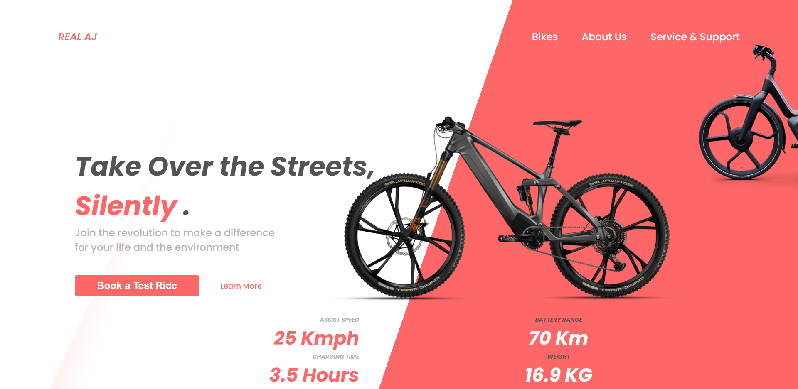

# LANDING PAGE - BIKE

### Sobre:
- Site do tipo lading page para divulgar a bike Real-J. O objetivo deste projeto é colocar em prática os conhecimentos adquiridos no curso do SENAI Jandira na criação de web sites.

### Tecnologias utilizadas: 
- HTML
- CSS

[Clique aqui para vizualizar a página](https://ingryd16.github.io/oficial/).

### Autor: 
- Ingryd Shirlley
